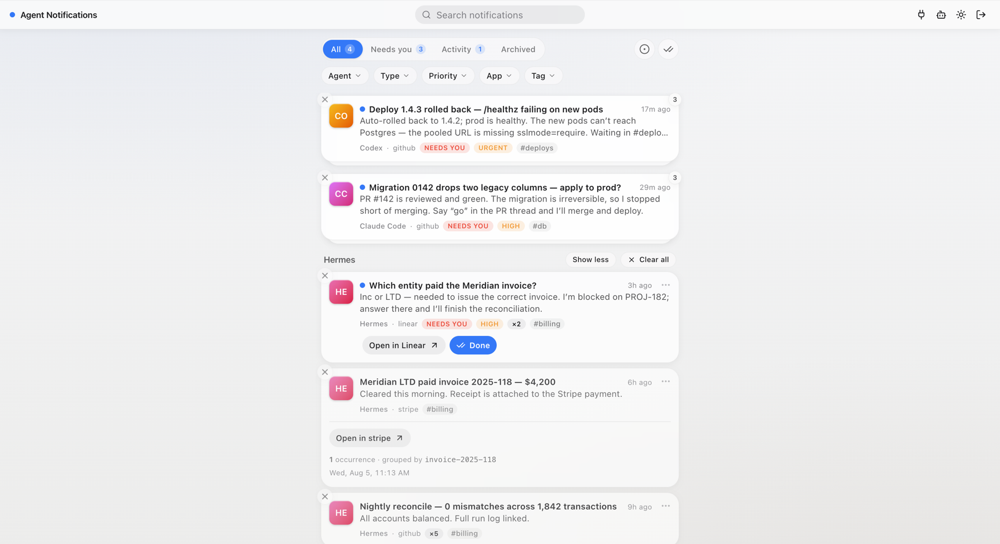
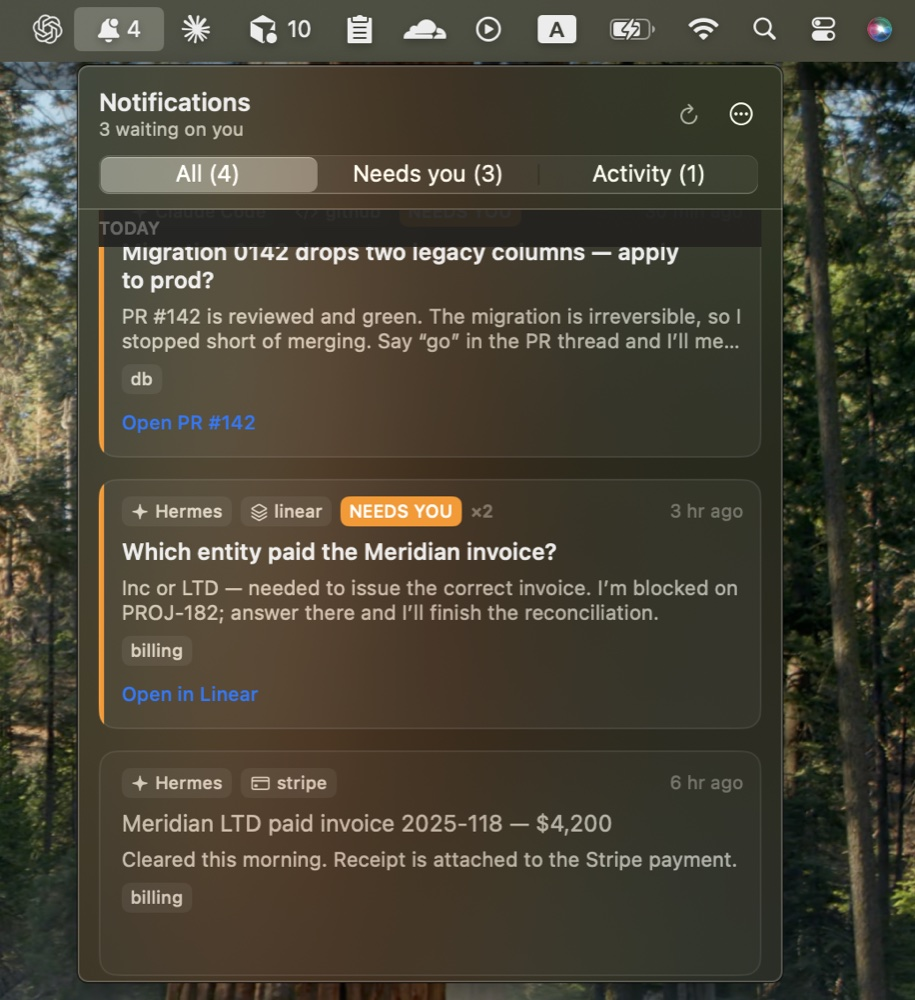

<p align="left">
  
</p>

[](https://github.com/harariguy/agent-center/actions/workflows/ci.yml)
[](https://pypi.org/project/agent-center-app/)
[](LICENSE)
[](https://www.python.org/downloads/)

**A self-hostable notification layer for AI agents.** One feed for everything your
agents did — and everything waiting on you.

Agents open pull requests, file tickets, send messages, run on schedules. What they
lack is a decent way to tell you about it: pasting into a chat channel doesn't group,
doesn't distinguish "FYI" from "I'm blocked", and buries the one thing that needs you
under twelve that don't. This is a small server with one job — agents report to it,
you read a clean feed and click through to where the work actually lives.



<p align="center">
  
</p>

## A notification layer only

It sits *beside* your agents, not around them. It does not run or orchestrate them,
hold conversations, gate anything behind approvals, or replace a channel you already
use. Traffic is one-way by design: agents write, you read and click out. If an agent
needs an answer, its notification says where it's waiting — you answer it there, in
its own channel, not here.

```
 MCP client ──▶  /mcp  ──────────────┐
                                     ├──▶  agent-center  ──▶  your browser
 cron / CI  ──▶  POST /api/v1/…  ────┘           │
                                        groups repeats, splits
                                        "activity" from "attention"
```

Four things a chat channel can't do:

- **Grouping.** Repeats sharing a `group_key` fold into one entry with a count —
  "raised 10 times over 19 days" is one row, not ten pings.
- **Attention vs activity.** "I opened a PR" and "I'm blocked and need you" are
  different kinds of message, and the feed knows the difference.
- **Regression semantics.** A grouped item that fires again after you've read it
  comes back unread. Archived stays archived — a re-fire opens a fresh entry.
- **A link out, not a copy.** Every card deep-links to the source app. This is the
  index of the work, not the destination.

## Quickstart

```sh
pip install agent-center-app       # or pipx install agent-center-app
agent-center serve                 # → http://127.0.0.1:8765 (SQLite in ~/.agent-center/)
```

The package installs as `agent-center-app` — PyPI rejects names that differ from
an existing project only by punctuation, and `agentcenter` was taken. The command
you run, and everything else, is `agent-center`.

If 8765 is taken the server says so and refuses — pick another with
`agent-center serve --port 8766`.

Register an agent (in another shell):

```sh
agent-center agent add my-agent
# prints a bearer token (shown once) and a ready-to-run curl
```

Connect a harness — Claude Code, for example:

```sh
claude mcp add --transport http agent-center http://127.0.0.1:8765/mcp \
  --scope user --header "Authorization: Bearer <token>"
```

Or click **Connect an agent** in the UI for copy-paste steps per client — including
a single prompt to hand an agent that configures itself. Send one by hand:

```sh
curl -X POST http://127.0.0.1:8765/api/v1/notifications \
  -H "Authorization: Bearer <token>" \
  -H "Content-Type: application/json" \
  -d '{
    "type": "input.needed",
    "category": "attention",
    "priority": "high",
    "group_key": "PROJ-182",
    "title": "Which entity paid the Meridian invoice?",
    "body": "Inc or LTD — needed to issue the correct invoice.",
    "source": {"app": "linear", "link": "https://linear.app/acme/issue/PROJ-182"},
    "actions": [{"label": "Open in Linear", "url": "https://linear.app/acme/issue/PROJ-182"}]
  }'
```

Open http://127.0.0.1:8765 — it's in the feed. Fire the same `group_key` again and
the card shows **×2** instead of duplicating.

Local mode is the default: loopback bind, SQLite, no password, UI open. The loopback
bind *is* the security boundary; agent tokens are still required for writing, because
they are identity (who sent this), not just auth.

To keep it running on a Mac — start at login, restart on crash —
[`docs/launchd.plist`](docs/launchd.plist) is a ready LaunchAgent: fill in the two
paths per its comments, copy it to `~/Library/LaunchAgents/`, `launchctl load` it.

## Hosting it

Run the server on something always-on and your browser and remote agents reach the
same URL. Two rules, enforced rather than suggested:

- **`ADMIN_PASSWORD` is required.** On a non-loopback bind (or Vercel) the server
  refuses to start without it — and a passwordless server answers loopback peers
  only, whatever it ended up bound to. `ALLOW_INSECURE_BIND=1` opts out behind a
  tailnet or authenticating proxy.
- **TLS is the platform's job.** Managed platforms terminate it; on a VPS put Caddy
  in front (see `docker-compose.yml`). Never expose plain HTTP.

Browsers sign in with the password. Browserless readers — a retention cron, the menu
bar app — use **viewer tokens** (`agent-center viewer add cron`, prints once).
Viewer tokens read and triage; agent tokens write; neither can manage agents — that
takes the password session, so a stolen device token can't mint itself a write
credential.

**Render** — one click: [](https://render.com/deploy?repo=https://github.com/harariguy/agent-center)
`render.yaml` provisions the service, a disk, and a generated `ADMIN_PASSWORD`
(read it from Dashboard → Environment). Free-tier variant in the file's comments.

**Docker**: `docker compose up -d` — reads `ADMIN_PASSWORD` from `.env` (see
`.env.example`), stores SQLite in a volume. One process, one worker: scale the box.

**Vercel + Neon**: `api/index.py`, `vercel.json`, and `requirements.txt` ship ready.
Set `DATABASE_URL` (Neon's *pooled* string, rewritten `postgresql+psycopg://…`),
`ADMIN_PASSWORD`, and `CRON_SECRET` (a viewer token) so the daily cron can call
`/api/v1/prune`.

## Connecting agents

The HTTP API is the only thing that writes; every other channel is a client of it.
Remote MCP is mounted in the same process at `POST /mcp` — streamable HTTP,
stateless, authenticated by the same per-agent bearer token — so connecting any
harness is one URL and one header. Four tools:

| Tool | |
|---|---|
| `report_activity` | Something happened, no reply needed → Activity |
| `request_input` | You are stuck and need the human → Needs you |
| `list_open_notifications` | What you already filed, so you reuse a `group_key` instead of duplicating it |
| `resolve_notification` | Clear your own item once it stops needing anyone |

Category is carried by the *tool name* rather than an enum field: choosing between
two named tools is a decision a model actually makes; filling in a `category` field
is one it defaults through. The full field rules live in one markdown file served at
`GET /api/v1/guide.md` and as the MCP `initialize` instructions, so no harness keeps
a copy that can go stale.

## Let the agent install itself

Most connections aren't configured by hand — you hand the agent one prompt and it
does its own setup. **Connect an agent** in the UI mints a per-agent token and
renders that prompt (plus by-hand steps per client). Pasted at the agent, it:

1. adds the MCP server to its own config (or falls back to plain HTTP),
2. reads the field rules at `/api/v1/guide.md`,
3. installs the skill from `/api/v1/skill.md` into its own skill directory,
4. on Hermes, installs the session hook from `/api/v1/hooks/hermes/` (see below),
5. confirms by sending a `setup-check` card you watch land in the feed.

Everything an agent needs to bootstrap itself is served ungated as plain text, so
this also works headless — point any agent at the URLs directly:

| URL | What it is |
|---|---|
| `GET /api/v1/guide.md` | The field rules (same text as the MCP `initialize` instructions) |
| `GET /api/v1/skill.md` | The installable skill, URLs pre-resolved to this server |
| `GET /api/v1/hooks/hermes/plugin.py` + `plugin.yaml` | The Hermes session hook |

None of these carry secrets — the agent's token lives only in its own MCP config.

## Why MCP alone isn't enough — the skill

An `mcp_servers` entry means an agent *can* notify, not that it will. Harnesses
decide what to do by scanning their skill index before they act, and a server that
exists only in a config file is invisible to that pass. So the install flow ends with
the agent fetching **`GET /api/v1/skill.md`** and writing it into its own skill
directory: MCP delivers the capability, the skill delivers the policy.

Its triggers are deliberately post-conditions on the agent's own work — a
notification skill that fires only when you already thought to ask is the failure it
exists to prevent:

```yaml
triggers:
  - you created, shipped, merged, filed, or sent something the user would want to know about
  - you stopped because you need a decision, an answer, or a credential from the user
  - a scheduled, cron, or background run finished, succeeded, or failed
```

(It also tells agents not to satisfy "notify me" with `osascript` or `notify-send` —
a desktop toast that nothing collects.)

## Guaranteeing the policy is heard — the Hermes session hook

The skill has one weakness left: it reaches the model only when the harness's
skill scan surfaces it. A session where that pass misses runs with no notify
policy in context at all — and the sessions most at risk are exactly the
unattended ones (gateway, cron, background workers) that most need to report.

For harnesses with a hook system, Agent Center closes that gap with a served
lifecycle hook. Hermes is the first: `GET /api/v1/hooks/hermes/plugin.py` and its
`plugin.yaml` are a complete Hermes plugin registering a `pre_llm_call` hook that
prepends the reporting policy to the **first message of every session** — CLI,
gateway, cron, and kanban runs alike. Delivery stops being probabilistic.

Three things the hook deliberately does *not* do:

- **Send anything itself.** It only puts text in front of the model, so every
  card in the feed stays model-authored — no canned "session ended" noise.
- **Interrupt.** First message of a session, once. No per-turn nudges, no
  stop-blocking, no re-asks.
- **Break anything.** It fails open, and `AGENT_CENTER_ENFORCE=off` disables it
  without uninstalling.

Installing it is part of the normal Hermes flow — the single prompt in
**Connect an agent** includes it. By hand:

```sh
mkdir -p ~/.hermes/plugins/agent-center
curl -o ~/.hermes/plugins/agent-center/__init__.py http://127.0.0.1:8765/api/v1/hooks/hermes/plugin.py
curl -o ~/.hermes/plugins/agent-center/plugin.yaml http://127.0.0.1:8765/api/v1/hooks/hermes/plugin.yaml
hermes plugins enable agent-center
```

`hermes plugins list` should show it enabled; it loads from the next session on.
To watch it work, make the *first* message of a fresh session "repeat any
bracketed policy text prepended to this message" — the model quotes the
`[agent-center]` block back. (`hermes hooks list`/`test` covers shell hooks only,
so the plugin correctly does not appear there.)

Only Hermes has a hook today. Other harnesses get the same treatment as their
hook systems allow, under the same `/api/v1/hooks/<harness>/` layout — see
[`agent_center/hooks/README.md`](agent_center/hooks/README.md).

## The notification model

| Field | Meaning |
|---|---|
| `type` | Namespaced event name: `pr.opened`, `ticket.created`, `job.failed`, `input.needed` |
| `category` | `activity` (something happened) or `attention` (something is waiting on you) |
| `priority` | `min · low · normal · high · urgent` |
| `group_key` | Stable id for a recurring item (ticket ref, job name). Repeats fold into one entry. Optional — without it, a normalised title fingerprint stands in. |
| `source` | `{app, link}` — where the work lives; the UI links out to it |
| `actions` | Up to 5 `{label, url}` link buttons |

Retries: send an `Idempotency-Key` header and a re-delivery of the same fire counts once.

## Configuration

| Variable | Default | |
|---|---|---|
| `DATABASE_URL` | `sqlite:///~/.agent-center/notifications.db` | any SQLAlchemy URL; Postgres via the `[postgres]` extra |
| `HOST` / `PORT` | `127.0.0.1` / `8765` | |
| `ADMIN_PASSWORD` | *(empty)* | empty = UI open, loopback requests only |
| `ALLOW_INSECURE_BIND` | *(unset)* | `1` allows a public bind with no password, for tailnets/auth proxies |
| `RETENTION_DAYS` | `90` | unseen notifications are pruned after this; `0` disables |

## API

Interactive docs at `/docs`. Errors are RFC 7807 `application/problem+json`; the
feed is cursor-paginated. `GET /api/v1/notifications` filters on `category`, `type`,
`agent`, `source_app`, `priority`, `tag`, `unread`, `archived`, and `q`;
`/notifications/facets` returns the available values with counts — it's what the
filter menus are built from. `POST /api/v1/agents/{slug}/token` rotates a credential
(only hashes are stored, so tokens can never be re-shown).

## Optional: the macOS menu bar app

`clients/macos/` is a native menu bar client (pictured above) — one more reader of the same read API,
for the feed and its banners without keeping a browser tab open. It authenticates
with a viewer token, polls conditionally (an idle minute costs a handful of 304s),
and reads, archives, and snoozes in place. macOS 14+, builds with the Command Line
Tools alone:

```sh
cd clients/macos && make install
```

See [clients/macos/README.md](clients/macos/README.md).

## Status

Early, and deliberately narrow: one-way visibility is the whole scope, now and later.
On the roadmap: SSE live updates (the UI polls every 30s today; `/facets` answers 304
when nothing changed), snooze/mute rules, session hooks for more harnesses (Hermes
ships today; Claude Code next) plus stronger opt-in enforcement modes for them, and
Web Push for `urgent`. Not on the roadmap: replies, approvals,
or anything that would make this a place work happens rather than a place work is
reported.

## Development

See [CONTRIBUTING.md](CONTRIBUTING.md) for scope, checks, and PR guidance.

```sh
python3 -m venv .venv && .venv/bin/pip install -e ".[dev]"
.venv/bin/pytest
.venv/bin/agent-center serve            # → http://127.0.0.1:8765
```

The UI is a React app in `frontend/` (Vite, TypeScript, Tailwind,
[shadcn/ui](https://ui.shadcn.com), TanStack Query), built into
`agent_center/static/` so the wheel ships it and `pip install` users never
touch npm:

```sh
cd frontend
pnpm install
pnpm dev        # dev server on :5173, proxies /api to :8765
pnpm build      # emits into agent_center/static/
```

MIT licensed. Brand assets and usage notes live in [`brand/`](brand/).
